# Block P2 (Cafe) — Onboarding Workflow & Schema Mapping, Generalization Test (hardest case)

**Scope:** not a fresh design. Takes the bar-pass flow (`docs/block-p/p2-workflow-schema.md`) and the pub-pass adaptation (`docs/block-p-pub/p2-workflow-schema-pub.md`) and runs a real Victorian **cafe** through it — a venue that may hold no liquor licence at all, or a minor one, has an espresso/food-prep equipment profile instead of a bar/cellar, and where food safety (not alcohol compliance) is very likely the dominant real compliance risk. Per the task brief, this is the hardest generalization test in the Block P series because it stresses the flow's opposite-case assumption: every prior pass assumed alcohol exists somewhere in the venue. Every section below says explicitly whether the flow held, needed adaptation, or needed genuinely new branching. Nothing is silently marked "same as bar/pub."

**Current schema confirmed live via Supabase MCP (`kkgnjbqmhagspeomlzav`, `list_tables`, read-only) before writing this document** — re-verified rather than trusted from either prior doc's text:
- `venue_licence_profile` — live, 1 row. Columns: `id, venue_id (unique), state, address, abn, licence_type, licence_number, licensed_capacity, approved_trading_hours (jsonb), late_night_endorsement (bool), conditions, created_at`. **No `licence_status` or `is_licensed` column** — a venue with no licence is represented only by the *absence* of a row, not by an explicit stored fact. This turns out to matter (see Finding 1).
- `venue_contacts` — live, 3 rows. Unchanged since the pub pass.
- `staff_roles.fallback_tier` (`frontline`/`authorized`), `knowledge_chunks.is_restricted`, `module_sections.is_restricted` — all live, unchanged (role-tiered fallback, Tech Bible §15i).
- `stations` — unchanged: `id, venue_id, name, qr_code_slug, primary_module_id, created_at`. No structured equipment-detail columns (same shape the bar and pub passes both mapped onto; still no field for e.g. "is this a temperature-controlled unit").
- Still **not built**, confirmed absent again this pass: any `menu_items`/allergen table (bar gap #3 / pub Finding 1), any vendor/security-firm table (bar gap #2), any banned-patron register (bar gap #6), any roster table (bar gap #9), any `venue_promotions`/happy-hour table (pub Finding 2). Nothing has been built since the pub pass, as the task brief stated — confirmed independently rather than assumed.
- `certificate_types` remains a simple `(id, venue_id, name)` table with no fixed taxonomy — "RSA," "Food Handling," "Food Safety Supervisor" are just rows a venue happens to have created. Nothing stops a cafe from simply never creating an RSA-named row, which is exactly the mechanism the no-licence branch below relies on.

**Module Content & Assessment Standard, Part 0/A, re-checked live in Notion before writing this (fetched 2026-09-07, page unchanged since the pub pass's 2026-09-06 check):** 3–6 sections per module, one check-question per section (except purely context-setting sections), numbered steps reserved for genuine sequences, 1–2 safety callouts per module, callouts reserved strictly for safety-critical content. This cap is directly relevant to the allergen-matrix finding below, same mechanism as the pub pass, now with an added cafe-specific wrinkle (Finding 2).

---

## 1. The flow (Mermaid)

Reused wholesale where the bar/pub structure generalizes. Five branches are genuinely new, substantially restructured, or explicitly dropped — marked `NEW` / `ADJUSTED` / `DROPPED` in the diagram itself. The single biggest structural change is the licensing branch: it now has a real root gate for "no licence at all," which the bar and pub flows never needed because both venues held one.

```mermaid
flowchart TD
    A["Start: new venue onboarding"] --> B["Venue Basics: legal/trading name, address, ABN, state/territory, seating layout"]
    B --> C{"State/territory = Victoria?"}
    C -- "No" --> C1["Flag: non-VIC taxonomy not built — escalate to founder"]
    C -- "Yes" --> D["Staffing: real role names + FOH/BOH tag per role"]
    D --> D2["Rostering: shift assignment, roster location, who manages swaps"]

    D2 --> LIC0{"NEW ROOT GATE — does the venue hold, or plan to hold, any liquor licence at all (including an informal BYO setup where the venue does not sell alcohol)?"}
    LIC0 -- "No licence — fully dry, or BYO where venue never sells alcohol" --> LICSKIP["Skip the entire RSA / crowd-control / happy-hour subtree cleanly: no RSA row created in certificate_types, no venue_licence_profile row, no capacity/crowd-control questions asked at all. Optional light 'responsible BYO service' content only if the venue permits patrons to bring their own (corkage, glassware, no service of alcohol by staff) — not compliance-required, author's discretion."]
    LIC0 -- "Yes — holds or is applying for a licence" --> E

    E{"Licence type (VCGLR)?"} -- "On-premises licence — typical for a cafe: small wine/beer list tied to meals" --> GCAFE["Limited-licence conditions: licensed capacity, approved trading hours, area conditions — scaled down, late-night endorsement essentially never applies"]
    E -- "General licence — rare for a cafe (e.g. converts to a licensed wine-bar format at night)" --> F["Full-licence conditions, unchanged from bar/pub"]
    E -- "Other / unsure" --> G2["Flag for founder review — reserved for genuinely ambiguous cases now that 'no licence' has its own first-class branch above; must not be used as a catch-all for unlicensed venues the way the bar/pub taxonomy forced"]

    GCAFE --> CCGATE
    F --> CCGATE
    CCGATE{"ADJUSTED FOR CAFE: does capacity/trading hours trigger mandatory crowd control?\n(near-universally No for a small daytime cafe — default expectation flips from bar/pub)"}
    CCGATE -- "No (expected default)" --> K["Basic conflict de-escalation content only — no dedicated crowd-control branch"]
    CCGATE -- "Yes (rare — e.g. licensed evening events)" --> J["Crowd controller detail: unchanged from bar/pub mechanism, rarely exercised"]

    K --> L["RSA — reached only via the licensed path; mandatory for any venue serving even a small wine/beer list"]
    J --> L
    L --> M{"RSA marshal designated?"}
    M -- "Yes (unlikely at cafe scale)" --> N["RSA marshal duties"]
    M -- "No (expected default)" --> O["Standard RSA-trained-staff content only"]

    LICSKIP --> P
    N --> P
    O --> P

    P{"Food service level?"}
    P -- "ADJUSTED: cafe food service — even a small kitchen/prep area is almost always Class 1/2 risk under the Food Act, so this lands in the same branch as bar/pub's 'full kitchen,' just relabeled — kitchen SIZE is not what triggers the FSS requirement, risk CLASS is" --> Q["Food Safety Supervisor identified"]
    Q --> Q1["HACCP-style program: temperature logs, cleaning schedule, receiving checks"]
    Q1 --> WEIGHT["NEW: food-safety weighting note — with alcohol compliance minor or absent, this branch is very likely carrying most of the venue's real compliance risk; default to 2-3 modules (Food Safety Program / Temperature & Cleaning Logs / Allergen & Dietary Guide) rather than the single branch-among-many treatment bar/pub gave it"]
    WEIGHT --> Q2{"How many distinct menu items/variants need dietary tagging?"}
    Q2 -- "Small, fixed menu (<10 items, no swaps)" --> Q3["Fits inside normal module_sections content, within the 3-6 section / 1-2 callout standard"]
    Q2 -- "Large, fixed items (pub-scale, 20-40+ distinct dishes)" --> Q4["Breaks the authoring caps as prose — same as pub Finding 1"]
    Q2 -- "NEW: large AND modifier-based — cafe-typical GF bread swap, dairy-free/plant milk swap, vegan swap applied across most menu items" --> Q5["BREAKS DOWN FURTHER than the pub case: this is not just a big flat matrix, it's a combinatorial one — base item x swappable modifier. A flat menu_items table cannot represent it without either duplicating every item per modifier combination or losing the swap relationship entirely. See Finding 2."]

    Q3 --> T
    Q4 --> T
    Q5 --> T["Menus: coffee/drinks list + food menu; dietary tags per item where structurally possible, narrative elsewhere"]
    P -- "Packaged/low-risk only (e.g. a coffee cart with no food prep)" --> R["Light food handling: safe storage & display, basic hygiene — FSS not required at this risk class"]
    P -- "No food service at all" --> S["Skip food handling/allergen modules entirely"]
    R --> T
    S --> T

    T --> HH1{"Happy hour / discounted pricing? — gated behind the licensed path only; skipped entirely and not even asked on the no-licence path"}
    HH1 -- "Yes (uncommon for a cafe, e.g. evening wine specials)" --> HH2["Happy hour detail, unchanged mechanism from pub pass"]
    HH1 -- "No (expected default, or route never reached at all)" --> HH3["Skip"]

    HH2 --> U
    HH3 --> U["Equipment & stations: cafe equipment profile replaces bar/cellar entirely"]
    U --> U1{"NEW: espresso machine on-site?"}
    U1 -- "Yes (expected default)" --> U2["Espresso equipment: daily backflush/cleaning cycle, descaling cadence, water filter/softener changeover, steam-wand burn-hazard callout"]
    U1 -- "No" --> U3
    U2 --> U3{"NEW: food prep equipment beyond basic (slicers, mixers, blenders)?"}
    U3 -- "Yes" --> U4["Food prep equipment: guarding/lockout before cleaning, blade-changing procedure, safety callout"]
    U3 -- "No" --> U5
    U4 --> U5{"NEW: temperature-controlled display (bain-marie / cabinet / fridge display)?"}
    U5 -- "Yes (expected default for a cafe with a cabinet)" --> U6["Display/cabinet temperature control: target range, logging cadence — dual-homed into the Food Safety HACCP section, same dual-homing pattern the pub pass used for CO2/gas cylinders"]
    U5 -- "No" --> V
    U6 --> V["OHS: manual handling, chemical/cleaning safety, hazard/near-miss reporting"]
    V --> V1["Steam-wand burn hazard and slicer/blade hazard from Equipment feed into OHS callouts, same dual-homed pattern as pub's CO2/gas — not just an operating step"]

    V1 --> W["Cash handling: float, EFTPOS reconciliation — safe code itself tier-gated, is_restricted=true, unchanged mechanism"]
    W --> W2["Petty cash: threshold, sign-off, purpose"]
    W2 --> X["Closing procedures: till reconciliation, stock lock-up, alarm set — ADJUSTED: the 'last-drinks/RSA compliance check' line item from bar/pub is dropped entirely on the no-licence path and folded conditionally on the limited-licence path; CCTV review is optional content, not forced, since many small cafes have none"]
    X --> Y{"Security scope beyond RSA/crowd control?"}
    Y -- "Crowd controllers used (rare)" --> Y1["Security module, unchanged mechanism, almost never exercised for a cafe"]
    Y -- "No crowd controllers (expected default)" --> Y2["Folded into Closing Procedures as a lighter section, no standalone module — this is the dominant outcome for a cafe, not an edge case"]

    Y1 --> Z["Business continuity: emergency contacts, utility/POS outage, supplier fallback, insurance"]
    Y2 --> Z

    Z --> AA["Raw answers compiled per venue into sop_source_documents"]
    AA --> AB["Content Author Agent drafts modules / module_sections / check_questions per the Module Content & Assessment Standard"]
    AB --> AC{"Owner approval gate"}
    AC -- "Changes requested" --> AB
    AC -- "Approved" --> AD["Module status set to live; re-embedded into knowledge_chunks"]
```

---

## 2. Schema mapping — the three areas under test

### 2.1 Licensing branch, stress-tested for the no/low-alcohol case

| Question / group | Branch | Type | Destination | Verdict |
|---|---|---|---|---|
| Does the venue hold any liquor licence at all? | New root gate (`LIC0`) | A (routing) | Determines whether `venue_licence_profile` row, RSA `certificate_types` row, and the whole capacity/crowd-control/happy-hour subtree are created at all | **This is the fix.** The bar/pub flow's licence-type question (`E`) had no "none" option — only General/Club, On-premises, or "Other/unsure." An honestly unlicensed cafe forced through that node has nowhere to land except "Other/unsure," which routes to founder escalation. That is the wrong outcome for the single most common case a cafe presents: nothing is unusual or ambiguous about a cafe with no liquor licence, but the old flow's own taxonomy had no way to say so. |
| Licence type, once `LIC0` = Yes | `E` (unchanged mechanism) | A | `venue_licence_profile.licence_type` | Holds once gated correctly — the node itself didn't need to change, only its position in the tree (now reached only after confirming a licence exists at all). |
| Licensed capacity, trading hours, conditions | `GCAFE`/`F` | A | `venue_licence_profile.licensed_capacity`, `.approved_trading_hours`, `.conditions` | Holds unchanged. A cafe's on-premises licence just produces smaller numbers, not a different schema shape. |
| RSA requirement | `L` | A (routing) | `certificate_types` (name='RSA') + `certificate_type_roles`, only created on the licensed path | Holds — this is exactly the mechanism (a `certificate_types` row simply never gets created) that makes the no-licence skip clean at the schema layer, no new column needed to represent "this venue has no RSA requirement." |
| Crowd control gate | `CCGATE` | A (routing) | Determines whether a Security & Crowd Control `modules` row is created | Holds mechanically unchanged from bar/pub; only the *expected default answer* flips (near-universally No for a cafe vs. a coin-flip for a bar, skewing Yes for a pub). No schema change, a genuine behavioral/UX note for whoever runs the onboarding interview. |
| Happy hour / promotional pricing | `HH1` | A (routing) | Same as pub Finding 2 — no structured destination, Type B narrative only | Holds mechanically, but now gated behind the licensed path so it is never even asked for the (likely majority) of cafes with no licence — this wasn't possible to express cleanly in the pub flow because the pub flow had no upstream "licensed at all" gate to hang it off. |

**Finding 1 — `venue_licence_profile` cannot currently distinguish "deliberately unlicensed" from "not yet collected."** With the new root gate above, a genuinely dry or BYO-only cafe correctly ends up with **no row** in `venue_licence_profile` — clean by the standard the bar pass itself set (a table row is either populated or the fact doesn't apply). But an absent row is ambiguous by construction: it looks identical whether (a) the onboarding specialist deliberately determined the venue holds no licence, or (b) nobody has gotten to that question yet, or (c) a specialist forgot to ask. Neither the bar pass nor the pub pass surfaced this because both of their test venues held a licence, so the absent-row case was never actually produced. A future owner dashboard or an onboarding-completeness check ("which venues are missing licence data?") cannot tell these apart today. **Recommend:** add `venue_licence_profile.licence_status` (`none` / `byo_unlicensed` / `limited` / `full`) as an enum column, populated for every venue including unlicensed ones — i.e., the no-licence branch should still write a minimal row (`licence_status='none'`, everything else null) rather than writing nothing. This is a small, additive schema change, not a new table.

### 2.2 Allergen/dietary matrix — recurs, and the cafe wrinkle is real

| Question / group | Type | Destination | Notes |
|---|---|---|---|
| Small, fixed cafe menu (<10 items) | B | `module_sections.content` | Fits inside the Standard's caps, same as the bar's bar-snacks case. |
| Large, fixed-item cafe menu (a full breakfast/brunch kitchen, 20-40+ distinct dishes, no swaps) | A (structural, still impossible) | **NO DESTINATION** — recurrence of pub Finding 1, same underlying gap (no `menu_items` table) | Confirmed recurring, not re-discovered as new. Same authoring-cap breakdown the pub pass found: a matrix this size cannot be authored as prose inside 3–6 sections / 1–2 callouts. |
| Large AND modifier-based (cafe-typical: GF bread swap, dairy-free/plant-milk swap, vegan swap available across most items) | A (structural, worse than pub's case) | **NO DESTINATION**, and the pub pass's proposed fix does not fully cover it | **This is the cafe-specific wrinkle — see Finding 2.** |

**Finding 2 — cafe dietary-variant menus break not just the authoring format (already known from the pub pass) but the *proposed schema fix itself*.** Cafe culture leans heavily into "any item, any milk" / "GF available on request" patterns — a menu of 20 base items with 3–4 swappable dietary modifiers each is not equivalent to a pub's 30 fixed dishes; it's closer to 20 base items × up to 4 modifier combinations, i.e., a genuinely combinatorial structure, not just a longer flat list. The `menu_items` table the bar pass proposed and the pub pass reaffirmed (`venue_id, name, category, allergens, description`) has no way to represent "this item, with this swap, changes its allergen profile" — it would force either (a) one row per base item × per modifier combination, which duplicates the base item's data across every variant and drifts the moment the base recipe changes, or (b) collapsing the swap information into free-text `description`, which puts the exact thing this table exists to make queryable back into unstructured prose. **A real fix needs a modifier/variant shape, not just a bigger `menu_items` table** — e.g., `menu_items` (the base dish) plus `menu_item_modifier_groups` (venue_id, name e.g. "Milk choice," "Bread choice") and `menu_item_modifiers` (group_id, name e.g. "Oat milk," "Gluten-free bread," allergen_delta) that a menu item can reference. This is a genuinely new finding — neither the bar nor pub pass needed to consider modifiers because neither venue type's menu is built around a base-item-plus-swap pattern the way cafe menus routinely are. Until this is built, the honest state is: cafe dietary-variant information has nowhere structurally correct to live, and even the previously-recommended `menu_items` table would need to be extended, not just populated, to hold it correctly.

**Practical pattern note (per the task brief's suggestion):** tagging by dietary *category* (Vegan / Vegetarian / GF / DF / Nut-free) rather than raw allergen list is indeed the more natural authoring pattern for a cafe — it matches how cafe menus are actually marketed to customers and is arguably easier to keep current than a raw allergen matrix. But category tagging does not avoid Finding 2 — the same combinatorial problem exists whether the tag vocabulary is "contains egg" or "not vegan"; the swap relationship (base item + modifier) is the actual structural gap, independent of which tagging vocabulary is layered on top of it.

### 2.3 Food safety weighting

| Question / group | Type | Destination | Notes |
|---|---|---|---|
| Food Safety Supervisor identity | A | `staff_certificates` against a `certificate_types` row, same mechanism as bar/pub | Holds unchanged. |
| HACCP-style program | B | `module_sections.content` | Holds unchanged, but see the weighting note below for module *count*, not mechanism. |
| Overall proportion of the flow's compliance content that is food-safety-driven vs. alcohol-driven | — | No schema change | See Finding 3. |

**Finding 3 (design note, not a schema gap) — food safety needs to become structurally more central for a cafe, not just content-deeper.** The bar flow treated food handling as one branch among many (RSA, crowd control, cash handling, closing, food handling, OHS, business continuity all roughly co-equal). For a cafe with no or minor alcohol licensing, several of those branches collapse to near-nothing (`LICSKIP`, `K`, `Y2` as the dominant outcomes) while food safety does not shrink at all — if anything it's the one branch guaranteed to be fully exercised regardless of licensing status. Nothing in the schema needs to change to support this — `modules`/`module_sections`/`certificate_types` already scale to as many modules as a venue needs — but the onboarding flow's own defaults should reflect it: the `WEIGHT` node in the diagram makes explicit that a cafe should default to 2–3 food-safety modules (Food Safety Program, Temperature & Cleaning Logs, Allergen & Dietary Guide) rather than the single combined module the bar pass used for a bar-snacks-only venue, given food safety is very likely carrying most of the venue's real compliance risk. This mirrors the same "split rather than exceed the section cap" mechanism the pub pass already validated for its HACCP program (§2.1 of that document) — reused here as a default rather than a one-off.

### 2.4 New equipment branch — espresso, food prep, temperature-controlled display

| Question / group | Type | Destination | Verdict |
|---|---|---|---|
| Espresso machine as a physical station | A | `stations` (name="Espresso Machine", qr_code_slug, primary_module_id, venue_id) | Generalizes cleanly — same QR-anchored station pattern bar equipment and the pub's cellar both already used (Tech Bible §15a). A coffee machine is just another station. |
| Backflush/cleaning cycle, descaling cadence, filter changeover | B | `module_sections.content` | Narrative, same as any equipment-care procedure in the bar/pub flow. |
| Steam-wand burn hazard | B (safety-critical) | `module_sections.content` as a Callout block, dual-homed into the Equipment module and the OHS module | Same dual-homing pattern the pub pass established for CO2/gas cylinder safety — reused directly, no new mechanism needed. |
| Food prep equipment (slicers, mixers, blenders) as stations | A | `stations`, same as above | Generalizes cleanly. |
| Guarding/lockout, blade-changing procedure | B (safety-critical) | `module_sections.content` as a Callout, dual-homed into Equipment + OHS | Same pattern again. |
| Temperature-controlled display (bain-marie / cabinet / fridge display) as a station | A | `stations`, same as above | Generalizes cleanly. |
| Target temperature range, logging cadence | B, dual-homed | `module_sections.content` in both the Equipment module (how to operate/check it) and the Food Safety HACCP module (it IS a temperature log point) | Same dual-homing pattern as pub's CO2/gas — this is genuinely the same mechanism, not a new one, applied to a different hazard/compliance category. |
| Structured equipment facts (is this unit temperature-controlled? does it require logging?) | A (structural, currently impossible) | **NO DESTINATION** | Minor, same class as pub Finding 3 (`stations` has no detail columns) — not urgent, noted for completeness rather than as a new discovery. |

**Verdict: the "Equipment & stations" branch generalizes structurally without any schema change** — `stations` already handles an arbitrary equipment inventory regardless of type, exactly as it did for bar equipment and the pub's cellar/keg setup. What needed real new structure was the *question set* (espresso/food-prep/display-cabinet sub-branches, `U1`/`U3`/`U5` in the diagram) and the explicit dual-homing of two safety-critical hazards (burns, blade injury) into OHS — both content/flow decisions, not database changes. This is the same shape of finding the pub pass made about its cellar/keg branch (new questions, no new tables) — confirmed recurring, not new.

---

## 3. Verdict

### Generalized cleanly, no adaptation needed
- Venue basics / `venue_licence_profile` mechanism (once gated correctly — see below) — the table itself needed no schema change to hold a cafe's smaller numbers.
- `venue_contacts` — unchanged, absorbs business continuity contacts identically.
- Staffing, rostering questions — unchanged, still unbuilt as structured data (bar-pass gap #9), but the question flow itself generalizes as-is.
- RSA branch mechanism, including the marshal sub-branch — once reached only via the licensed path, the branch's internal logic needed no change at all.
- Role-tiered fallback (`fallback_tier`, `is_restricted`) for the safe code — reusable without modification, same as it was for the pub's cellar access.
- Cash handling, petty cash — content-only, no structural or logical change; a cafe's float and EFTPOS reconciliation work exactly the same way as a bar's.
- `stations` as the equipment mechanism — holds for an entirely different equipment set (espresso/food-prep/display vs. bar/cellar) without any table change, same conclusion the pub pass reached for its cellar.
- Business continuity, OHS as a category, and the ingestion/authoring pipeline (`sop_source_documents` → `modules`/`module_sections` → `check_questions` → `knowledge_chunks` → owner approval gate) — all unchanged, correctly treated as the universal destination for narrative content regardless of venue type.
- Dual-homing safety-critical equipment content into OHS — the pattern the pub pass established for CO2/gas cylinders reapplies directly to steam-wand burns and blade hazards with zero modification needed.

### Needed real adaptation (bar/pub-specific assumption that didn't fit as-is)
- **Licensing branch root gate** — the single biggest adaptation in this pass. The bar/pub licence-type question assumed a licence exists and offered no "none" outcome; a genuinely unlicensed cafe forced through it either gets miscategorized as "Other/unsure" (wrongly triggering founder escalation for an entirely normal, unambiguous case) or the flow has to be manually skipped by whoever runs the interview, which is exactly the kind of implicit, undocumented workaround this whole exercise exists to catch. Fixed by adding `LIC0` as a true root gate before the licence-type question, so the RSA/crowd-control/happy-hour subtree is skipped cleanly and structurally (no `certificate_types` RSA row, no `venue_licence_profile` row) rather than awkwardly force-answered.
- **Crowd control / security default** — same mechanism as bar/pub, but the *expected default answer* flips hard: bar treated it as a real branch point, pub skewed it toward Yes, cafe should default to No and treat Yes as the rare case. No schema change; a behavioral note for the onboarding specialist.
- **Closing procedures content** — the bar/pub text bakes "last-drinks/RSA compliance check" and "CCTV review" into the closing sequence as if every venue has both. For an unlicensed cafe the RSA/last-drinks line item is simply wrong to include, and CCTV is genuinely optional at cafe scale rather than assumed. Adapted by conditionally stripping the RSA-linked line on the no-licence path rather than forcing boilerplate that doesn't apply — a content-authoring adjustment, no schema change.
- **Food-safety branch weighting** — structurally unchanged tables, but the flow's own defaults need to treat this branch as proportionally larger (2–3 modules by default) given it is very likely the venue's dominant real risk once alcohol compliance drops away or shrinks to near nothing.
- **Equipment & stations question set** — cellar/keg/tap questions dropped entirely (genuinely N/A for a cafe, not just unlikely), replaced with espresso/food-prep/display-cabinet sub-branches. Same `stations` table, materially different question tree.

### Explicitly degrades to "not applicable" cleanly (confirmed, not just assumed)
- Crowd control and security branches collapse to their existing "No"/"folded into Closing" outcomes (`K`, `Y2`) without any forced questions once `CCGATE`/`Y` are reached — these nodes already had a clean not-applicable path in the bar/pub design, it just becomes the dominant outcome for a cafe rather than an edge case. No flow change was needed here beyond the upstream licensing gate; the mechanism itself already degraded gracefully.
- Happy hour is skipped entirely (not merely defaulted to No) for any venue that never reaches the licensed path at all, which is a cleaner degradation than the pub flow could offer, since the pub flow had no upstream gate to hang the skip on.
- Gaming/EGM licensing (the pub pass's Finding 4) is dropped from the cafe flow entirely rather than represented as an escalation branch — this is correctly N/A for a cafe, not an unresolved question the way it was for a pub.

### New schema/design gaps this pass found that neither bar nor pub surfaced
1. **`venue_licence_profile` cannot distinguish "deliberately unlicensed" from "not yet collected."** Recommend adding a `licence_status` enum column and writing a minimal row even for unlicensed venues, so the fact is stored rather than inferred from absence. (Finding 1, §2.1)
2. **The proposed `menu_items` fix (from bar/pub) does not hold for cafe-style modifier/swap menus.** A base-item-plus-swappable-modifier menu structure (GF bread, dairy-free milk, vegan swap available across most items) needs a modifier/variant relationship (`menu_item_modifier_groups` / `menu_item_modifiers`), not just a bigger flat `menu_items` table. This sharpens the known allergen-table gap from "the table doesn't exist" (bar) and "it's worse at scale" (pub) to "the previously-proposed shape is itself insufficient for this venue type." (Finding 2, §2.2)
3. **Licensing root-gate logic itself was missing, not just a schema gap.** The bar/pub flow's licence-type question had no "no licence" outcome at all — this is a flow-design gap that neither prior pass could have surfaced, since both test venues held a licence and so never exercised the missing branch. (§2.1, §3 above)

Bar-pass gaps #2 (vendor/security-firm table), #6 (banned-patron register), #9 (roster), and pub-pass Findings 2 (happy-hour storage) and 3 (`stations` detail columns) remain unbuilt and unchanged in status by this pass — the cafe test doesn't add urgency to any of them (if anything, #2 and #6 become less relevant for a cafe than they were even for the bar, since crowd control is essentially never exercised).

---

*Design document only. No application code, module content, or Notion pages were modified in producing this. Supabase access was read-only (`list_tables`).*
