# Block P2 (Pub) — Onboarding Workflow & Schema Mapping, Generalization Test

**Scope:** this is not a fresh design. It takes the bar-pass flow at `docs/block-p/p2-workflow-schema.md` and runs a real Victorian **pub** through it — fuller menu, heavier/more varied alcohol, happy-hour pricing, keg-heavy cellar — per the locked project decision that pub is a generalization test of the bar schema, not a new build. Every section below says explicitly whether the bar flow held, needed adaptation, or needed a genuinely new branch. Nothing is silently marked "same as bar."

**Current schema confirmed live via Supabase MCP (`kkgnjbqmhagspeomlzav`, `list_tables`, read-only) before writing this document, not assumed from the bar doc's gap list:**
- `venue_licence_profile` — **live**, 1 row (closes bar-pass gap #1).
- `venue_contacts` — **live**, 3 rows (closes bar-pass gap #7).
- `staff_roles.fallback_tier` (`frontline`/`authorized`), `knowledge_chunks.is_restricted`, `module_sections.is_restricted` — **all live** (role-tiered fallback, Tech Bible §15i).
- Still **not built**: any `menu_items`/allergen table (gap #3), any vendor/security-firm table (gap #2), any banned-patron register (gap #6), any roster table (gap #9).
- No happy-hour/promotional-pricing field anywhere, on `venues`, `venue_licence_profile`, or any other table — confirmed absent, not previously checked by the bar pass because the bar flow never asked the question.
- `stations` is unchanged from the bar pass: `id, venue_id, name, qr_code_slug, primary_module_id, created_at` — no structured equipment-detail columns (tap count, gas cylinder count, cleaning cadence, etc.), same shape the bar pass mapped equipment onto.

**Companion research doc** (`docs/block-p-pub/p1-research-victoria-pub-delta.md`) was not yet present at the time of writing. The happy-hour branch below is built as reasonable placeholder branch logic per the task brief and should be cross-checked against that research once it lands, specifically for any Victorian promotional-pricing regulation (e.g. responsible-service interaction with discounted drinks) that should gate or qualify the questions.

**Module Content & Assessment Standard, Part 0, re-checked in Notion before writing this** (fetched live 2026-09-07): an SOP must specify trigger/scope, who performs it, materials/equipment, the real step sequence, safety-critical steps called out explicitly, a checkable definition of done, and a named escalation contact. Part A caps a module at 3–6 sections with 1–2 safety callouts. This cap is directly relevant to finding #1 below — it is the mechanism by which the full-kitchen branch actually breaks.

---

## 1. The flow (Mermaid)

Reused wholesale where the bar structure generalizes; three branches are genuinely new or substantially extended, marked `NEW` / `EXTENDED` in the diagram itself.

```mermaid
flowchart TD
    A["Start: new venue onboarding"] --> B["Venue Basics: legal/trading name, address, ABN, state/territory, seating & standing layout"]
    B --> C{"State/territory = Victoria?"}
    C -- "No" --> C1["Flag: non-VIC taxonomy not built — escalate to founder"]
    C -- "Yes" --> D["Staffing: real role names + FOH/BOH tag per role"]
    D --> D2["Rostering: shift assignment, roster location, who manages swaps"]

    D2 --> E{"Liquor licence type (VCGLR)?"}
    E -- "General licence (typical for a pub)" --> F["Full-licence conditions: licensed capacity, trading hours, late-night endorsement, area/beer-garden conditions"]
    E -- "On-premises licence" --> G["On-premises conditions"]
    E -- "Other / unsure" --> G2["Flag for founder review"]
    F --> F1{"ADJUSTED FOR PUB: does the venue hold a gaming machine (EGM) entitlement?"}
    G --> H
    F1 -- "Yes" --> F2["Flag: gaming/EGM is a materially different regulatory regime (separate VCGLR gaming licence, Responsible Gambling Code) — NOT covered by this flow, escalate to founder before treating as in-scope"]
    F1 -- "No" --> H
    F2 --> H["Patron capacity & crowd control gate"]

    H --> I{"ADJUSTED FOR PUB: capacity/trading-hours trigger mandatory crowd controllers?\n(pubs skew larger than the bar test venue — this gate defaults toward Yes far more often)"}
    I -- "Yes" --> J["Crowd controller detail: security firm, licence numbers, radio/comms, incident hand-off, banned-patron handling scope"]
    I -- "No" --> K["Basic conflict de-escalation content only"]

    J --> L["RSA — always asked"]
    K --> L
    L --> M{"RSA marshal designated?"}
    M -- "Yes" --> N["RSA marshal duties + escalation authority"]
    M -- "No" --> O["Standard RSA-trained-staff content"]

    N --> P{"Food service level?"}
    O --> P
    P -- "Full kitchen meals — STRESS-TESTED FOR REAL THIS PASS" --> Q["Food Safety Supervisor identified"]
    Q --> Q1["HACCP-style program: temperature logs, cleaning schedule, receiving checks"]
    Q1 --> Q2{"How many distinct menu items need allergen tagging?"}
    Q2 -- "Small (bar-snack-scale, <10 items)" --> Q3["Allergen info fits inside normal module_sections content, within the 3-6 section / 1-2 callout standard"]
    Q2 -- "Large (real pub kitchen, 20-40+ items across mains/sides/sauces)" --> Q4["BREAKS DOWN: a full matrix this size cannot fit the Authoring Standard's section/callout caps as prose — see Finding 1"]
    P -- "Bar snacks only (packaged/low-risk)" --> R["Light food handling: storage & display, basic hygiene"]
    P -- "No food service" --> S["Skip food handling/allergen modules"]

    Q3 --> T
    Q4 --> T["Menus: drinks/cocktail list + food menu if applicable; allergens tagged per item"]
    R --> T
    S --> T
    T --> T1["EXTENDED FOR PUB: keg/tap list captured alongside cocktail list — tap count, rotating vs fixed lines, ABV range across a heavier/more varied alcohol offering"]

    T1 --> HH1{"NEW BRANCH: does the venue run happy hour or discounted pricing?"}
    HH1 -- "Yes" --> HH2["Happy hour detail: which days/hours, which products/categories discounted, any promotional constraint the venue is aware of (placeholder logic — cross-check against p1-research-victoria-pub-delta.md once available)"]
    HH1 -- "No" --> HH3["Skip — no happy-hour content or data captured"]

    HH2 --> U
    HH3 --> U["Equipment & stations: bar equipment always; kitchen equipment if food branch != none"]
    U --> U1{"NEW SUB-BRANCH: dedicated cellar and/or 10+ tap lines?"}
    U1 -- "Yes" --> U2["Cellar/keg-at-volume: cellar location & access control, CO2/gas cylinder storage & safety, line-cleaning cadence at pub throughput, who manages keg changeovers"]
    U1 -- "No (small 4-6 line setup, generalizes cleanly from bar)" --> V
    U2 --> V["OHS: manual handling, chemical/cleaning safety, glass collection, hazard/near-miss reporting"]
    V --> V1["CO2/gas cylinder safety from the cellar branch feeds into OHS content, not just Equipment, since it's a real asphyxiation/explosion hazard, not just an operating procedure"]

    V1 --> W["Cash handling: float, safe drop, EFTPOS reconciliation (safe code itself tier-gated, is_restricted=true)"]
    W --> W2["Petty cash: withdrawal threshold, sign-off, purpose"]
    W2 --> X["Closing procedures: till reconciliation, stock lock-up, alarm set, last-drinks/RSA check, CCTV review"]
    X --> Y{"Security scope beyond RSA/crowd control?"}
    Y -- "Crowd controllers used" --> Y1["Security module: bag checks, ID scanning, duress alarm, banned-patron handling — ADJUSTED: more likely to be exercised for real at pub scale than at the bar test venue"]
    Y -- "No crowd controllers" --> Y2["Security folded into Closing Procedures, lighter section"]

    Y1 --> Z["Business continuity: emergency contacts, utility/POS outage, supplier fallback, insurance"]
    Y2 --> Z

    Z --> AA["Raw answers compiled per venue into sop_source_documents"]
    AA --> AB["Content Author Agent drafts modules / module_sections / check_questions per the Module Content & Assessment Standard"]
    AB --> AC{"Owner approval gate"}
    AC -- "Changes requested" --> AB
    AC -- "Approved" --> AD["Module status set to live; re-embedded into knowledge_chunks"]
```

---

## 2. Schema mapping — the three areas under test

### 2.1 Food-full-kitchen branch, actually exercised

| Question / group | Type | Destination | Verdict |
|---|---|---|---|
| Food Safety Supervisor identity | A | `staff_certificates` against a `certificate_types` row (e.g. "Food Safety Supervisor"), distinct from the general "Food Handling" cert type | Holds. Same mechanism the bar pass designed, now actually populated for real. |
| HACCP-style program (temp logs, cleaning schedule, receiving checks) | B | `module_sections.content`, Food Handling module | Holds structurally, but see the section-count finding below — a real kitchen's HACCP program is more content than a bar snack venue's, and pushes toward needing 2 modules (e.g. "Food Safety Program" + "Kitchen Cleaning & Temperature Logs") rather than 1, which the Standard already permits (split rather than exceed 6 sections) but the bar pass never had to actually do. |
| Per-menu-item allergen matrix, at pub scale (20–40+ items) | A (structural, still impossible) | **NO DESTINATION** — same underlying gap as bar-pass gap #3, but now materially worse | **This is where the branch actually breaks.** See Finding 1. |

**Finding 1 — the full-kitchen branch was designed but not load-bearing until now, and it does not survive contact with a real pub kitchen.** The bar pass identified gap #3 (no `menu_items`/allergen table) but never felt its full weight, because the bar test venue used the bar-snacks branch instead — a handful of packaged items describable in a paragraph. A pub with a real kitchen (mains, sides, sauces, specials) has an allergen matrix an order of magnitude larger. Run through the Module Content & Assessment Standard's own caps (3–6 sections per module, 1–2 safety callouts, 2–4 sentences per body block):
- A 30-item allergen matrix does not fit as prose inside a body-text block, and does not fit the intent of the callout block either (callouts are for 1–2 safety-critical call-outs per module, not a full reference table).
- Forcing it into `module_sections.content` as a giant list produces exactly the kind of content the Standard is designed to prevent — a wall nobody reads, and worse, a wall Ask Larder still has to answer "does the parma have nuts in it" from via unstructured `knowledge_chunks` retrieval, with no way for the app to do a structured per-item lookup or flag a stale entry when the menu changes.
- **This is not just a schema gap, it is a content-format gap.** The Authoring Standard has no block type suited to a genuine reference-table dataset. Building `menu_items` (venue_id, name, category food|drink, allergens, description) — as the bar pass already recommended — would fix both problems at once: it gives the app a structured allergen lookup, and it takes the matrix out of the module's prose entirely (the module can then just say "see the Allergen Guide" and link/query the structured data), keeping the module itself inside the 3–6 section standard.
- **Verdict: does the branch capture enough for HACCP compliance?** Procedurally, yes — FSS identity, temperature logging, cleaning schedule all have real homes. **Allergen-matrix-wise, no** — a full-kitchen pub cannot produce Standard-compliant module content for its allergen matrix without either (a) building `menu_items`, or (b) accepting a permanent workaround where the matrix lives as an oversized, standard-violating section.

### 2.2 Happy hour / promotional pricing (new branch)

| Question / group | Type | Destination | Notes |
|---|---|---|---|
| Does the venue run happy hour / discounted pricing? | A (routing) | Determines whether a Happy Hour content block/section exists at all | No schema write itself. |
| Which days/hours | Ideally A, currently B only | **NO DESTINATION** | Same shape as the licence-hours gap the bar pass found (approved trading hours) — narrative-describable, but nothing structured. |
| Which products/categories are discounted | B | `module_sections.content` | Fine as narrative — this is genuinely procedural/informational content for staff ("happy hour runs 4–6pm weekdays, house tap beer and house wine only"), not something the app needs to query today. |
| Promotional constraints the venue is aware of | B | `module_sections.content` | Flag explicitly for cross-check against `p1-research-victoria-pub-delta.md` once available — Victoria may have RSA-adjacent rules about discounted drink promotions (e.g. restrictions on time-limited free/discounted drink offers) that should shape this question, not just record it. |

**Finding 2 (new gap).** There is no structured place to store happy-hour hours or pricing anywhere in the schema — not on `venues`, not on `venue_licence_profile` (whose `approved_trading_hours` jsonb is scoped to *licensed* trading hours, a different fact, and reusing it would conflate the two exactly as the bar pass warned against doing with `shift_windows`). Today this has to be pure Type B narrative. That's workable for a staff-facing SOP fact ("what discount am I allowed to apply and when"), but if the product ever wants to *display* happy hour times anywhere structurally (a staff dashboard tile, a public-facing venue page, a scheduled Ask Larder proactive nudge at 4pm) there is nowhere for that to live. Recommend, if that need ever materializes: a small `venue_promotions` table (venue_id, day_of_week, start_time, end_time, description) rather than overloading an existing jsonb column.

### 2.3 Cellar/keg management at volume

| Question / group | Type | Destination | Notes |
|---|---|---|---|
| Cellar as a physical location | A | `stations` (name="Cellar", qr_code_slug, primary_module_id, venue_id) | Generalizes cleanly — this is exactly the QR-anchored station pattern the bar pass already mapped equipment onto (Tech Bible §15a). A cellar is just another station. |
| Cellar access control (who holds keys/access) | B, tier-gated if genuinely access-restricted | `module_sections.content`, `is_restricted=true` if the venue treats cellar access like the safe code | Same mechanism as the bar pass's revised safe-code handling (role-tiered fallback, gap #5's resolution) — reusable as-is, no new schema needed. |
| CO2/gas cylinder storage & safety | B (safety-critical) | `module_sections.content` as a Callout block in both the Cellar/Equipment module and the OHS module | Genuinely dual-homed content — this is a real asphyxiation/explosion-adjacent hazard, not just an operating step, so it belongs in OHS too, not only "how to change a keg." No schema gap, just a content-placement call the flow now makes explicit. |
| Line-cleaning cadence at higher throughput | B | `module_sections.content` | Narrative, same as bar. |
| Who manages cellar changeovers | A | `module_roles` scoping the Cellar module to the relevant role(s) (e.g. Cellarman/Duty Manager) | Same mechanism as bar's Closing Procedures role-scoping — generalizes cleanly. |
| Tap count, cylinder count/location as structured facts | A (structural, currently impossible) | **NO DESTINATION** | See Finding 3. |

**Finding 3 (new gap, smaller than Findings 1/2).** `stations` holds only `name, qr_code_slug, primary_module_id` — no structured equipment-detail fields. This was already true for the bar's 4–6 line setup, but the bar pass never needed to note it because nobody asked "how many taps does this station have" as a question the app itself might need to answer. At pub scale (10+ taps, multiple gas cylinders) it's worth flagging even though it's genuinely optional: today the honest answer is that tap count / cylinder count / changeover cadence are Type B narrative facts living in `module_sections.content`, same as every other piece of equipment detail in the bar flow. This is consistent with how the bar pass treated equipment generally (Type B, not structural), so it is **not** a new inconsistency — just worth naming explicitly since the task asked. Only worth a schema change (e.g. a `stations.details jsonb` column) if the product later wants to query equipment facts structurally (e.g. a cylinder-safety-check reminder tied to a count) — no evidence that need exists yet.

---

## 3. Verdict

### Generalized cleanly, no adaptation needed
- Venue basics / `venue_licence_profile` (state, ABN, licence number/type, capacity, trading hours) — built and live exactly as the bar pass specified.
- `venue_contacts` — built and live, absorbs business continuity contacts unchanged.
- Staffing, rostering questions (still unbuilt as structured data per gap #9, but the *question flow* generalizes as-is).
- RSA branch including the marshal sub-branch — no pub-specific change needed.
- Role-tiered fallback (`fallback_tier`, `is_restricted`) for safe codes and, newly, cellar access — reusable without modification.
- Cash handling, petty cash, closing procedures — content-only, no structural change.
- OHS structure as a category — reusable, just gains new content (gas safety) rather than needing new schema.
- Business continuity — unchanged.
- Ingestion/authoring pipeline (`sop_source_documents` → `modules`/`module_sections` → `check_questions` → `knowledge_chunks` → owner approval gate) — unchanged and correctly treated as the destination for all narrative content regardless of venue type.

### Needed real adaptation (bar-specific assumption that didn't fit)
- **Patron capacity & crowd-control gate** — the bar pass modeled this as a genuine branch point (Yes/No, roughly evenly weighted for a small bar). For a pub it should be treated as skewing heavily toward "Yes" by default; the gate logic itself doesn't need to change, but the *default assumption* an onboarding specialist brings into the conversation should, since a typically-larger venue makes "no crowd controllers" the less likely branch, not a coin flip.
- **Security branch depth** — same gate, same schema, but now genuinely exercised (multiple crowd controllers, banned-patron handling as a real operational need rather than a theoretical one) — this makes bar-pass gap #6 (no banned-patron register table) more relevant for a pub than it was for the bar, though still not urgent enough to force building it now.
- **Food-full-kitchen branch** — structurally holds for FSS/HACCP, breaks down for the allergen matrix once actually exercised at real pub scale (Finding 1).
- **Equipment & stations** — extended with a real cellar/keg-at-volume sub-branch; the underlying `stations` table needed no schema change, but the question set needed to grow.

### Genuinely new (not a bar-flow adaptation)
- **Happy hour / promotional pricing** — did not exist in the bar flow at all. Added as a full branch (§1, node `HH1`–`HH3`); placeholder logic per the task brief, flagged for cross-check against `p1-research-victoria-pub-delta.md` once it exists.
- Also added: a gaming-machine (EGM) gate at the licence-type branch (`F1`/`F2`) — not requested explicitly by the task, but surfaced by walking a real pub through the licence branch: Victorian pubs commonly hold gaming entitlements, which is a separate regulatory regime (a distinct VCGLR gaming licence, Responsible Gambling Code obligations) that the bar flow's licence taxonomy has no way to represent. Flagged as an escalate-to-founder branch rather than built out, consistent with how the bar pass handled "Other / unsure" licence types — this needs its own research pass before the flow can respond to "Yes" credibly.

### New schema gaps found that the bar pass didn't surface
1. **No structured happy-hour/promotional-pricing data anywhere** (Finding 2) — workable today as Type B narrative, but no home if the product ever needs it structurally.
2. **The Authoring Standard has no content block suited to a large reference-table dataset** (Finding 1) — a full multi-item allergen matrix cannot be authored inside the 3–6 section / 1–2 callout caps as prose. This sharpens bar-pass gap #3 from "the app can't query it" to "the module can't even be authored compliantly without it," which is a stronger claim than the bar pass was able to make since it never exercised the branch.
3. **`stations` has no structured equipment-detail fields** (Finding 3) — minor, consistent with how the bar pass already treated equipment as Type B content, but worth naming now that tap/cylinder counts at pub scale make "how much equipment" a question with an actual operational answer, not just a description.
4. **Gaming/EGM licensing is entirely unrepresented** — not a database gap so much as a missing taxonomy branch (same category as bar-pass gap #8, hardcoded-to-Victoria, but one level deeper: even within Victoria, the licence-type taxonomy doesn't yet cover a pub with gaming machines).

Bar-pass gaps #2 (vendor/security-firm table), #6 (banned-patron register), and #9 (roster) remain unbuilt and are unchanged in status by this pass — the pub test makes #6 more operationally relevant (see Security branch depth, above) but doesn't change the underlying recommendation from the bar pass.

---

*Design document only. No application code, module content, or Notion pages were modified in producing this. Supabase access was read-only (`list_tables`).*
