# Block P2 — Bar Onboarding Workflow & Schema Mapping

**Scope:** the onboarding question flow and branching logic for a Victorian, liquor-licensed **bar**, built on the founder's top-level categories (venue basics, staffing, OHS, food handling, allergens, RSA, menus, equipment, business continuity) with bar-specific branches surfaced explicitly (liquor licensing, patron capacity/crowd control, RSA service standards, closing procedures, cash handling, security).

This document answers two questions for the future onboarding-specialist software: **what do we ask, in what order, with what branches** — and **where does each answer actually go in the real Supabase schema**, flagging anywhere it doesn't yet go anywhere.

**State-specificity note (per CLAUDE.md):** this pass assumes Victoria (VCGLR-regulated liquor licensing, Food Act 1984 food safety classes). RSA and food-safety regulators/names differ by state, so the flow includes an explicit state gate up front — a non-Victoria venue must not silently reuse this branch's licence-type taxonomy.

**Two kinds of answer, mapped differently (this distinction matters — see schema mapping below):**
- **Type A — structural/configuration answers** (a role name, a licence number, which cert a role needs) map **directly** to a structured table row. No authoring step in between.
- **Type B — procedural/narrative answers** (how the venue actually does closing, what the RSA refusal script is) go through the real content pipeline: raw capture → `sop_source_documents` → authored `module_sections.content` (by the Content Author Agent, per the Module Content & Assessment Standard) → embedded into `knowledge_chunks` for Ask Larder → comprehension checks authored afterward into `check_questions`. Onboarding does **not** write `check_questions` directly; those are authored against the finished section content, not against the raw interview answer.

---

## 1. The flow (Mermaid)

```mermaid
flowchart TD
    A["Start: new venue onboarding"] --> B["Venue Basics: legal/trading name, address, ABN, state/territory, seating & standing layout"]
    B --> C{"State/territory = Victoria?"}
    C -- "No" --> C1["Flag: non-VIC licensing + food-safety taxonomy not yet built for this flow — escalate to founder before continuing licensing branch"]
    C -- "Yes" --> D["Staffing: capture the venue's real role names + FOH/BOH department tag for each"]

    D --> E{"Liquor licence type (VCGLR)?"}
    E -- "General licence / Full Club licence" --> F["Full-licence conditions: licensed capacity, approved trading hours, late-night endorsement Y/N, area/outdoor conditions"]
    E -- "On-premises licence" --> G["On-premises conditions: liquor tied to meals/function use, typically no late-night endorsement, capacity"]
    E -- "Other / unsure" --> G2["Flag for founder review — do not proceed on an assumed licence type"]

    F --> H["Patron capacity & crowd control gate"]
    G --> H
    H --> I{"Capacity/trading-hours trigger a crowd-controller requirement, or does the venue use them anyway?"}
    I -- "Yes" --> J["Crowd controller detail: security firm name, individual licence numbers, radio/comms protocol, incident hand-off procedure"]
    I -- "No" --> K["Basic conflict de-escalation content only — no dedicated crowd-control branch"]

    J --> L["RSA — always asked, mandatory for every licensed venue"]
    K --> L
    L --> M{"Does the venue designate an RSA marshal?"}
    M -- "Yes" --> N["RSA marshal duties: which role, roster requirement, marshal's escalation authority over standard staff"]
    M -- "No" --> O["Standard RSA-trained-staff-only content (ID checking, refusal, intoxication signs)"]

    N --> P{"Food service level?"}
    O --> P
    P -- "Full kitchen meals" --> Q["Full food safety: Food Safety Supervisor identified, HACCP-style program detail, full per-item allergen matrix"]
    P -- "Bar snacks only (packaged/low-risk)" --> R["Light food handling: safe storage & display, basic hygiene — FSS not required at this risk class"]
    P -- "No food service" --> S["Skip food handling/allergen modules — general hygiene content only"]

    Q --> T["Menus: drinks/cocktail list always captured; food menu captured only if food service exists; allergens tagged per item"]
    R --> T
    S --> T

    T --> U["Equipment & stations: bar equipment always (beer lines, glasswasher, coffee machine, cool room); kitchen equipment only if food branch != none"]
    U --> V["OHS: manual handling, chemical/cleaning safety, glass collection, hazard & near-miss reporting"]
    V --> W["Cash handling: float management, safe drop, EFTPOS reconciliation — the safe code itself is never captured as content, see gap note"]
    W --> X["Closing procedures: till reconciliation, stock lock-up, alarm set, last-drinks/RSA compliance check, CCTV review"]
    X --> Y{"Security scope beyond RSA/crowd control?"}
    Y -- "Crowd controllers used (from gate above)" --> Y1["Security module includes bag checks, ID scanning, duress alarm use, banned-patron handling"]
    Y -- "No crowd controllers" --> Y2["Security content folded into Closing Procedures as a lighter section, no standalone module"]

    Y1 --> Z["Business continuity: emergency contacts, utility/POS outage procedure, supplier fallback, insurance contact"]
    Y2 --> Z

    Z --> AA["Raw answers compiled per venue into sop_source_documents"]
    AA --> AB["Content Author Agent drafts modules / module_sections / check_questions per the Module Content & Assessment Standard"]
    AB --> AC{"Owner approval gate"}
    AC -- "Changes requested" --> AB
    AC -- "Approved" --> AD["Module status set to live; content re-embedded into knowledge_chunks for Ask Larder"]
```

---

## 2. Schema mapping

### 2.1 Venue basics

| Question / group | Branch | Type | Destination | Notes |
|---|---|---|---|---|
| Trading name | — | A | `venues.name` | Direct. |
| State/territory | Gates whole licensing branch | A | **NO CURRENT COLUMN** — see gap #1 | `venues` has no state/region field at all today. |
| Legal name, address, ABN | — | A | **NO CURRENT COLUMN** — see gap #1 | Nothing on `venues` holds these; needed for the licence-conditions module and for the printed compliance one-pager. |
| Liquor licence number, licence type, licensed capacity, approved trading hours, conditions | Licence-type branch | A | **NO CURRENT COLUMN/TABLE** — see gap #1 | This is the single biggest structural gap found in this pass. |
| Seating/standing layout, area map | — | B (narrative) | `sop_source_documents.raw_content` → `module_sections.content` (Venue/Licence Conditions section) | Descriptive, not a lookup value app code needs to query, so content pipeline is the right fit once captured. |

### 2.2 Staffing

| Question / group | Branch | Type | Destination | Notes |
|---|---|---|---|---|
| Real role names used at this venue (e.g. Bar Supervisor, Bar Attendant, Duty Manager, Glassie) | — | A | `staff_roles.name`, `staff_roles.venue_id` | Matches venue #1's precedent of replacing generic role names with the venue's real ones (Tech Bible §15c). |
| Department tag per role (FOH/BOH) | — | A | `staff_roles.department` | Column already exists (added §15c). Bar roles are near-universally FOH; only relevant if the bar also runs a kitchen. |
| Which roles are legally barred from serving alcohol (under 18) | — | B | `module_sections.content` in the RSA module + gates who `module_roles` links certain sections to | No dedicated "minimum age" column exists on `staff_roles`; captured as narrative policy, not enforced structurally. Flag if this ever needs runtime enforcement (e.g. blocking a shift assignment) — that would need a new column. |
| Named staff for invite (name, email/phone) | — | A | `app_users` rows (`role='staff'`, `name`, `email`, `phone`) | Technically onboarding-adjacent rather than SOP content — these become real login-invite rows, not module material. |

### 2.3 Liquor licensing (bar-specific branch)

| Question / group | Branch | Type | Destination | Notes |
|---|---|---|---|---|
| Licence type (General/Club vs On-Premises vs Other) | Root branch for this whole section | A | **NO DESTINATION** — see gap #1 | Determines which downstream questions apply but has nowhere structured to live once answered. |
| Licensed patron capacity | Feeds crowd-control gate | A | **NO DESTINATION** — see gap #1 | Also the number a real crowd-controller threshold check would need — currently uncheckable in software. |
| Approved trading hours, late-night endorsement | — | A | **NO DESTINATION** — see gap #1 | Could piggyback on `venues.shift_windows` (jsonb, currently used for staff shift context) but that column's stated purpose is staff rostering, not licence-approved trading hours — reusing it would conflate two different facts under one key. Recommend a dedicated field instead of overloading `shift_windows`. |
| Licence conditions (area restrictions, outdoor service limits) | — | B | `module_sections.content` (Venue/Licence Conditions section) | Narrative, fits the content pipeline once the licence number/type itself is captured structurally (gap #1). |

### 2.4 Patron capacity & crowd control (bar-specific branch)

| Question / group | Branch | Type | Destination | Notes |
|---|---|---|---|---|
| Does capacity/hours trigger mandatory crowd controllers, or does venue use them electively? | Gates security branch | A | Determines whether a "Security & Crowd Control" `modules` row is created at all | No schema write itself — a routing decision for content generation, not a fact to store. |
| Security firm name, individual controller licence numbers | Crowd-controller = Yes | A | **NO DESTINATION** — see gap #2 | No vendor/contractor table exists anywhere in the schema. |
| Comms/radio protocol, incident hand-off procedure | Crowd-controller = Yes | B | `module_sections.content` in Security & Crowd Control module | |
| `module_roles` targeting | Crowd-controller = Yes | A | `module_roles` (module_id, role_id) | Security module scoped to FOH/security-relevant roles rather than all staff. |

### 2.5 RSA (bar-specific branch, always asked)

| Question / group | Branch | Type | Destination | Notes |
|---|---|---|---|---|
| Which roles require RSA certification | — | A | `certificate_types` (name='RSA', venue_id) + `certificate_type_roles` (cert_id, role_id) | Direct extension of venue #1's existing pattern (Tech Bible §15c: FOH roles → RSA). |
| Individual staff RSA cert (photo, issue/expiry date) | — | A | `staff_certificates` (user_id, certificate_type_id, photo_ref, issued_date, expiry_date, status) | Feeds the existing cert-expiry nudge pipeline (§15e) unchanged. |
| Refusal procedure, ID-checking standard, intoxication-sign recognition | — | B | `module_sections.content` in RSA Service Standards module; safety-critical steps as callout blocks per the Module Content Standard | |
| Does venue designate an RSA marshal? | Marshal Y/N | A (routing) + B (content) | If Yes: an extra `module_sections` row (marshal duties) scoped via `module_roles` to the marshal's role only | No new table needed — this is just narrower role-scoping of existing tables. |

### 2.6 Food handling & allergens

| Question / group | Branch | Type | Destination | Notes |
|---|---|---|---|---|
| Food service level (full kitchen / bar snacks only / none) | Root branch | A (routing) | Determines whether Food Handling module + Food Handling `certificate_types` row are created at all | |
| Food Safety Supervisor identity (full kitchen branch only) | — | A | `staff_certificates` against a `certificate_types` row named e.g. "Food Safety Supervisor", distinct from the general "Food Handling" cert type already seeded for venue #1 | Victoria's Food Act 1984 requires a named FSS for Class 1/2 premises, not for Class 3 (low-risk, e.g. prepackaged snacks only) — this is exactly why the branch exists structurally, not just as a content difference. |
| HACCP-style program detail (temperature logs, cleaning schedule) | Full kitchen branch | B | `module_sections.content` in Food Handling module | |
| Light hygiene content (bar-snacks-only branch) | — | B | `module_sections.content`, shorter module (fewer sections, per the 3–6 section standard) | |
| Per-menu-item allergen matrix | Any food/drink service | A (structural, currently impossible) | **NO DESTINATION** — see gap #3 | This is the exact case the task called out to check for: there is genuinely no `menu_items`/allergen table in the schema. Today an allergen matrix could only exist as unstructured prose inside `module_sections.content`, which Ask Larder can still retrieve via `knowledge_chunks`, but nothing lets the app do a structured per-item allergen lookup or flag a menu change against it. |

### 2.7 Menus

| Question / group | Branch | Type | Destination | Notes |
|---|---|---|---|---|
| Drinks/cocktail list, standard pours | Always | A (ideally), currently B only | Same gap #3 as above — no `menu_items`/recipes table | Standard-pour *procedure* itself (how to build a measured pour, glassware standard) is legitimately narrative → `module_sections.content`; the *menu data* (item name, ABV, allergens) is not, and has no home. |
| Food menu | Only if food branch ≠ none | A/B split, same gap #3 | | |

### 2.8 Equipment & stations

| Question / group | Branch | Type | Destination | Notes |
|---|---|---|---|---|
| Bar equipment inventory (beer lines, glasswasher, coffee machine, cool room, kegerator, POS/EFTPOS terminal) | Always | A | `stations` (name, qr_code_slug, primary_module_id, venue_id) | Each becomes a physical QR-anchored station per the existing Feature #1 pattern (Tech Bible §15a). |
| Kitchen equipment | Only if food branch ≠ none | A | `stations`, same as above | |
| Cleaning/operating procedure per piece of equipment | — | B | `module_sections.content` of the module referenced by that station's `primary_module_id` | |

### 2.9 OHS

| Question / group | Branch | Type | Destination | Notes |
|---|---|---|---|---|
| Manual handling, chemical/cleaning safety, glass collection safety | Always | B | `module_sections.content` in an OHS module; safety-critical steps as callouts | |
| Who to escalate a hazard/near-miss to | Always | B, partial gap | Runtime reports land in `near_miss_reports` (venue_id, station_id, reported_by, description, status), but there is no venue-level config field for "who gets notified" | See gap #4 — escalation routing is currently implicit (owner views the dashboard), not a stored contact/rule. |

### 2.10 Cash handling (bar-specific branch)

| Question / group | Branch | Type | Destination | Notes |
|---|---|---|---|---|
| Float amount, till reconciliation process, EFTPOS reconciliation | Always | B | `module_sections.content` in Cash Handling module | |
| Safe drop procedure (the *process*) | Always | B | `module_sections.content` | |
| Who has the safe code / how the code is shared | Always | **Deliberately NOT ingested** | Must never reach `sop_source_documents` → `knowledge_chunks`, and module content should say "ask your supervisor for the safe combination" rather than state it — this is the locked Fallback Rule applied one step upstream, at intake time rather than at chat time. | See gap #5 — there is currently no mechanical safeguard stopping an onboarding specialist from accidentally typing a real code into the interview transcript that later gets embedded; today it relies entirely on the human doing the intake knowing not to ask for it. |

### 2.11 Closing procedures (bar-specific branch)

| Question / group | Branch | Type | Destination | Notes |
|---|---|---|---|---|
| Till reconciliation, stock lock-up, alarm set, last-drinks/RSA compliance check, CCTV review — as an ordered sequence | Always | B | `module_sections.content` as a numbered Step List block (the one place numbered markers are allowed per the Module Content Standard, since this genuinely is a sequence) | |
| Who is authorised to close (Duty Manager / 2IC only) | Always | A | `module_roles` scoping the Closing Procedures module to those `staff_roles` rows only | |

### 2.12 Security (bar-specific branch)

| Question / group | Branch | Type | Destination | Notes |
|---|---|---|---|---|
| CCTV monitoring, duress alarm use | Always (content depth varies) | B | `module_sections.content`, safety-critical steps as callouts | |
| Bag checks, ID scanning at door | Crowd-controller = Yes | B | `module_sections.content` in Security & Crowd Control module | |
| Banned-patron register | Either branch | A (structural, currently impossible) | **NO DESTINATION** — see gap #6 | If this needs to function as an actual checkable list (not just "there is a folder at the door"), there is nowhere to put it today. |

### 2.13 Business continuity

| Question / group | Branch | Type | Destination | Notes |
|---|---|---|---|---|
| Emergency contacts (fire/police non-emergency, plumber, electrician, area/licensee contact, regulator contact) | Always | A (structural, currently impossible) | **NO DESTINATION** — see gap #7 | This is the exact case the task brief predicted checking for, and it's real: there is no contacts table anywhere in the schema. |
| Power/POS outage procedure, supplier fallback, insurance contact info | Always | B (procedure) / A (contact) | Procedure → `module_sections.content`; the actual phone numbers/contacts → same gap #7 | |

### 2.14 Ingestion & authoring (applies to every Type B answer above)

| Stage | Destination |
|---|---|
| Raw interview answer captured | `sop_source_documents` (venue_id, raw_content, uploaded_at, processed_status='pending') |
| Structured into module content | `modules` (title, status='draft', version, created_from_sop_ids) + `module_sections` (section_order, content, photo_refs, video_ref) |
| Scoped to the right roles | `module_roles` (module_id, role_id) |
| Comprehension checks authored against the finished section (not the raw answer) | `check_questions` (question, options jsonb, correct_option_index) |
| Embedded for Ask Larder retrieval | `knowledge_chunks` (venue_id, source_module_id, content_chunk, embedding), re-run on every edit/approval |
| Owner approval gate | `modules.status` transitions `draft` → `pending_approval` → `approved` → `live`; this gate is non-negotiable per CLAUDE.md and must not be skipped by the onboarding tool regardless of how confident the auto-draft is |

---

## 3. Schema gaps found

These are genuine gaps in the current schema (Tech Bible §4/§15–§15h) surfaced by walking a real bar through this flow — not force-fit into existing tables:

1. **No venue licence/profile data at all.** `venues` currently holds only `name, branding, multi_venue_group_id, monthly_tier, cert_nudge_cadence, shift_windows`. There is no field for state/territory, address, ABN, liquor licence number, licence type, licensed patron capacity, or approved trading hours — and this is the root branch of the entire bar-specific flow. **NEW TABLE NEEDED:** `venue_licence_profile` (venue_id, state, address, abn, licence_type, licence_number, licensed_capacity, approved_trading_hours jsonb, late_night_endorsement boolean, conditions text). Without this, the licence-type branch has nowhere to persist the very answer that drives the rest of the tree.

2. **No vendor/contractor table** for crowd-controller/security-firm details (firm name, individual controller licence numbers). Could be folded into gap #7's contacts table if scoped generally enough, or split out as its own table if security-firm data needs fields contacts don't (licence numbers, contract dates).

3. **No menu/allergen table.** Nothing represents a menu item, a drink recipe, or a structured allergen tag. Everything allergen- or menu-related currently has to live as prose inside `module_sections.content`, which Ask Larder can still retrieve via `knowledge_chunks` but which the app can't query structurally (e.g. "list every drink containing egg white," or flag a stale allergen entry when a menu changes). **NEW TABLE NEEDED:** `menu_items` (venue_id, name, category food|drink, allergens text[] or jsonb, description).

4. **No venue-level hazard-escalation routing.** `near_miss_reports` captures the report itself, but nothing configures who should be notified when one is filed — today that's implicit (an owner has to check the dashboard). Minor gap, but real: a `near_miss_escalation_contacts` field or reuse of gap #7's contacts table would close it.

5. **No safeguard against sensitive content entering the knowledge base.** The Fallback Rule (never answer questions requiring access to keys/vaults/safes/alarm codes) is enforced at chat time via the system prompt, but nothing stops the actual code from being captured during onboarding and embedded into `knowledge_chunks` in the first place — at which point the fallback line becomes security theatre over a chunk that already contains the secret. Needs either an intake-time redaction step or a "do not ingest" flag on `sop_source_documents`.

6. **No banned-patron register table**, if that needs to function as an actual list rather than a physical folder the venue already keeps at the door. Flagging as optional/lower-priority — the SOP for *how* to check it can live as normal module content regardless of whether the list itself is ever digitised.

7. **No contacts table of any kind.** This is the gap the task brief specifically predicted checking for, and it's confirmed real: Business Continuity's emergency-contacts list (fire, police non-emergency, tradespeople, area manager, regulator, insurer) has no destination anywhere in the schema. **NEW TABLE NEEDED:** `venue_contacts` (venue_id, contact_type, name, phone, email, notes) — general enough to also absorb gap #2's security-firm contact and gap #4's escalation contact rather than building three narrow tables.

8. **Hardcoded to Victoria.** The licence-type taxonomy (General/Club vs On-Premises) and the food-safety class threshold (FSS required at Class 1/2, not Class 3) are both Victorian-specific. The flow's state gate (node C in the diagram) is the right place to branch by jurisdiction, but no other state's taxonomy has been built yet — this flow should not be silently reused for a venue outside Victoria.

---

*Design document only. No application code, module content, or Notion pages were modified in producing this.*
