# Block Q2 — Onboarding Wizard Flow & Schema

**Status: design doc + implemented migration. No frontend/API route code — Q4 (UI) and Q5 (parsing/embedding/content-authoring endpoints) build from this.**

**Migration:** `supabase/migrations/20260907120000_block_q_onboarding_wizard.sql`

This doc covers the full page sequence, exact branch conditions, the state model rationale, upload trigger points, and a field-by-field mapping from every question in `docs/block-q/q1-requirements-catalog.md` Part A to the wizard page that captures it.

---

## 1. State model

**Rule: guaranteed fields write directly to their real destination table on page submit. `wizard_sessions` never holds a staging copy of real data.**

This matches `CreateStationForm.tsx`'s convention exactly (client posts to an API route, API route writes straight to the real table, no draft/staging table in between). Two consequences that follow from this rule and are binding on Q4/Q5:

- **Back button preserves prior answers, not navigation state.** Because every page writes directly on submit, going back to an earlier page and re-rendering it means re-reading the real table (e.g. `venue_licence_profile`), not replaying a `wizard_sessions` snapshot. `wizard_sessions.current_step` is only a hint for "which page to open by default" — it must never gate whether a page's data can be read or edited. Every step page must be independently reachable and editable once page 1 (venue + owner creation) is done.
- **`wizard_sessions` exists for exactly three things:** (a) resume position (`current_step`), (b) branching flags derived from earlier answers so later pages don't have to re-query five tables to decide what to show (`venue_type_flags`), and (c) the gap-detection loop's own iteration log lives in a separate table (`onboarding_content_checks`), not in `wizard_sessions` itself, so multiple loop passes don't fight over a single JSON blob.
- **Idempotent writes on re-visit.** Any page a user can return to (which, per the rule above, is every page) must write with upsert semantics — `insert ... on conflict (venue_id) do update`, or a plain update-if-exists — never a bare insert that would throw or duplicate rows on a second submit. `venue_licence_profile` is the clearest case of this (see §3, LIC0 vs. Venue Basics below); `wizard_sessions` itself is also written this way, keyed on its own `venue_id unique` constraint.

### `venue_type_flags` vocabulary

Populated incrementally as the wizard progresses; Q4 reads it to decide what to show without re-deriving from raw table state on every page:

```json
{
  "licensed": true,
  "crowd_control_required": false,
  "rsa_marshal_designated": true,
  "food_service_level": "full_kitchen",
  "runs_happy_hour": true,
  "founder_escalation": ["gaming_egm", "non_vic_state"]
}
```

`founder_escalation` is an array, not a boolean — a venue can trip more than one escalation condition (e.g. a non-Victoria venue that also holds a gaming entitlement), and each entry is a UI dead-end for that specific sub-topic only, never a hold on the rest of the wizard (see §4, page 4).

---

## 2. Full page sequence (Mermaid)

```mermaid
flowchart TD
    P1["Page 1 — Owner + venue creation (pre-auth, bootstrap-owner RPC, unchanged)"] --> P2["Page 2 — Venue basics: trading name confirm, state/territory, address, ABN, legal name"]
    P2 --> VIC{"State/territory = Victoria?"}
    VIC -- "No" --> VICFLAG["Flag founder_escalation: non_vic_state. Wizard continues — downstream licence-type/food-safety-class taxonomy shown with a 'calibrated for Victoria, flagged for founder review' banner, never silently reused as-is."]
    VIC -- "Yes" --> LIC0
    VICFLAG --> LIC0

    LIC0{"Page 3 — LIC0 root licensing gate: does the venue hold, or plan to hold, any liquor licence at all (incl. informal BYO)?"}
    LIC0 -- "No licence — dry or BYO-only" --> SKIPLIC["licence_status = 'byo_unlicensed' or 'none'. Skip licence detail, crowd control, RSA, happy hour entirely — no venue_licence_profile licence fields asked, no RSA certificate_types row created."]
    LIC0 -- "Yes" --> C1["Page 4 — Licence detail: type, number, capacity, trading hours, late-night endorsement, conditions"]

    C1 --> GAMING{"Gaming/EGM entitlement?"}
    GAMING -- "Yes" --> GAMEFLAG["Flag founder_escalation: gaming_egm. Dead-end panel for this question only — no schema write, ever. Continue button still advances the wizard."]
    GAMING -- "No" --> CC
    GAMEFLAG --> CC

    CC{"Page 5 — Crowd control gate: mandatory or elective controllers? (default suggestion varies by venue-type flags, always asked when licensed)"}
    CC -- "No" --> RSA0
    CC -- "Yes" --> CC1["Page 5a/5b — Security firm contact (venue_contacts) + individual controller licence numbers (venue_contacts.notes freetext, 'not yet structured' UI badge)"]
    CC1 --> RSA0

    SKIPLIC --> FOOD0
    RSA0["Page 6a — Which staff roles require RSA? (certificate_types + certificate_type_roles)"] --> RSA1
    RSA1{"Page 6b — RSA marshal designated?"}
    RSA1 -- "Yes" --> RSA2["venue_key_roles(rsa_marshal) + 'may not have a login yet' UI flag"]
    RSA1 -- "No" --> FOOD0
    RSA2 --> FOOD0

    FOOD0{"Page 7 — Food service level: full kitchen / bar snacks-packaged-low-risk / no food service (risk-CLASS trigger, not kitchen-size)"}
    FOOD0 -- "Class 1/2 risk triggered" --> FOOD1["Page 7a — Food Safety Supervisor identity (venue_key_roles) + auto-created certificate_types row + login-unresolved UI flag"]
    FOOD1 --> FOOD2["Page 7b — Which staff roles require Food Handling cert? (certificate_types + certificate_type_roles)"]
    FOOD0 -- "Not triggered" --> MENU
    FOOD2 --> MENU

    MENU["Page 8a — Menu items (upload-parse or manual grid) -> menu_items"] --> MOD["Page 8b — Modifier groups + modifiers, only for items with swaps -> menu_item_modifier_groups / menu_item_modifiers"]
    MOD --> EQUIP["Page 8c — Equipment/station inventory (one generic form, not venue-type-branched -- see §3 correction below) -> stations"]

    EQUIP --> HH{"Page 9 — Happy hour: licensed AND confirmed only"}
    HH -- "not licensed" --> BC
    HH -- "licensed, no promo" --> BC
    HH -- "licensed, confirmed" --> HH1["venue_promotions rows (day/time/description)"]
    HH1 --> BC

    BC["Page 10 — Emergency/business-continuity contacts (repeatable) -> venue_contacts"] --> STAFF1
    STAFF1["Page 11a — Staff roles: name, FOH/BOH, fallback_tier, roster location -> staff_roles + venues.roster_location"] --> STAFF2
    STAFF2["Page 11b — Named staff for invite -> app_users"] --> SOP

    SOP["Page 12 — SOP/content intake hub: gap-detection loop (repeats per Part B topic) -> sop_source_documents, modules/module_sections/check_questions (Q5), onboarding_content_checks"] --> CERTS
    CERTS["Page 13 — Certificate types setup: confirm RSA/Food Handling/FSS already created, add WWCC (state-correct name) + First Aid -> certificate_types"] --> REVIEW
    REVIEW["Page 14 — Review & activate: owner approval gate, modules draft -> pending_approval -> approved -> live, wizard_sessions.status = 'completed'"]
```



---

## 3. Page-by-page detail

### Page 1 — Owner + venue creation
Reuses `bootstrapOwner()` / `POST /api/auth/bootstrap-owner` **unchanged**. Writes `venues.name`, `venues.slug`, and the owner's `app_users` row via the existing `bootstrap_owner` DB function. Immediately after this succeeds, the wizard creates its `wizard_sessions` row (`venue_id`, `started_by` = the new owner's `app_users.id`, `current_step = 'venue_basics'`, `status = 'in_progress'`).

### Page 2 — Venue basics
Writes an **upsert** into `venue_licence_profile` (`insert ... on conflict (venue_id) do update`) with `state`, `address`, `abn`, `legal_name`. `licence_status` is deliberately left null here — Page 3 owns that column exclusively.

**Design resolution worth flagging explicitly:** the task brief lists trading name/state/address/ABN/legal name together on "page 2," while also saying LIC0 (page 3) "writes a minimal `venue_licence_profile` row unconditionally." Since state/address/ABN/legal_name are themselves `venue_licence_profile` columns and are required for **all** venues (not just licensed ones), the row has to exist before LIC0 could sensibly be a pure "minimal row" write. Resolution: Page 2 is the page that actually creates the row (upsert), populated with everything that's true regardless of licensing; Page 3 then upserts the same row again, setting only `licence_status`. Both pages use `on conflict (venue_id) do update`, so either one running first (or a user reaching Page 3 directly via a resumed session that skipped Page 2 somehow) still leaves the row in a correct, non-absent state — which is what "writes a minimal row unconditionally" is actually protecting against.

State != Victoria triggers `founder_escalation: non_vic_state` immediately (not deferred to a later licensing page), because it affects every downstream licence-taxonomy and food-safety-class page, not just one.

### Page 3 — LIC0 root licensing gate
Upserts `venue_licence_profile.licence_status`. This is the one column this page owns. Also sets `venue_type_flags.licensed` (`true` for `limited`/`full`, `false` for `none`/`byo_unlicensed`).

Branch: `none`/`byo_unlicensed` skips straight to Page 7 (Food service level) — no licence detail, crowd control, RSA, or happy hour pages are shown at all, not merely defaulted-through. This is the exact behavior the cafe pass's Finding 1 was written to fix.

### Page 4 — Licence detail (licensed only)
Writes `venue_licence_profile.licence_type`, `.licence_number`, `.licensed_capacity`, `.approved_trading_hours` (jsonb, day-of-week keyed open/close pairs), `.late_night_endorsement`, `.conditions`.

`licence_type = 'Other/unsure'` and the gaming/EGM question both route to `founder_escalation` flags rather than attempting to model the answer — gaming specifically **never** gets a schema write of any kind, per Q1 Part C ("zero schema representation anywhere," and a real venue owner explicitly declined to have it modeled at all).

`licensed_capacity` and `approved_trading_hours` are compliance-critical per Q1's D.1.2 grading bar (must trace to the actual licence document, not recollection) — Q4 should render an explicit "sourced from the licence document" vs. "unconfirmed, pending the actual document" toggle next to these two fields specifically. No new column was added for this; it's a UI-only distinction communicated back to the owner as an outstanding action item, tracked the same way any other open follow-up is (owner dashboard TODO, outside this migration's scope).

### Page 5 — Crowd control gate (licensed only)
Always shown when `licensed = true` — the "capacity/hours trigger" language in Q1's catalog is a UX **default suggestion**, not a hard skip condition (Q1 row 31 explicitly: "this is a UX default, not a schema field"). The default pre-selected answer varies by venue-type flags (bar: no default lean; pub: defaults toward Yes; cafe: defaults toward No), but the question is always asked when licensed.

If Yes: Page 5a writes a `venue_contacts` row (`contact_type = 'security_firm'`). Page 5b writes a second `venue_contacts` row (`contact_type = 'crowd_control_licences'`, `name` = a short label like "Crowd controller licence numbers", `notes` = the freetext list of individual licence numbers) with a UI badge reading "not yet a structured field" rendered next to it — this satisfies Q1's D.1.5 pass condition (visibly labeled, not silently dropped, not stuffed into an unrelated column).

### Page 6a — RSA-required roles (licensed only)
Ensures a `certificate_types` row exists (`name = 'RSA'`, create-if-not-exists), then writes `certificate_type_roles` rows for every `staff_roles` id selected. At least one role must be selected.

### Page 6b — RSA marshal gate (licensed only)
Sets `venue_type_flags.rsa_marshal_designated`. If Yes: writes a `venue_key_roles` row (`role_type = 'rsa_marshal'`, `name`, `phone`, `email`, `app_user_id = null`). Q4 must render the "this person may not have an app_users login yet" note here — required by Q1's D.1.4 grading criterion, and this is genuinely the reason `venue_key_roles.app_user_id` is nullable rather than required.

### Page 7 — Food service level gate (all venues)
Sets `venue_type_flags.food_service_level` (`full_kitchen` / `bar_snacks_low_risk` / `no_food_service`). Per the cafe pass's correction, the branch that triggers a Food Safety Supervisor requirement is a **risk class** determination (Class 1/2 under the Food Act), not literally "has a full kitchen" — a cafe's small prep area lands in the same branch as a pub's full kitchen. Q4's copy for this page should ask about risk class directly (temperature-controlled/high-risk food handling present, yes/no) rather than "do you have a kitchen."

### Page 7a — Food Safety Supervisor identity (triggered only)
Writes `venue_key_roles` (`role_type = 'food_safety_supervisor'`) and auto-creates a `certificate_types` row (`name = 'Food Safety Supervisor'`, distinct from the generic "Food Handling" type). Same login-unresolved UI flag requirement as Page 6b.

### Page 7b — Food Handling-required roles (triggered only)
Same mechanism as Page 6a: `certificate_types` (`name = 'Food Handling'`) + `certificate_type_roles`.

### Page 8a — Menu items
Two entry paths, both landing on the same table:
- **Manual grid** — direct form writes to `menu_items` (`name`, `category`, `base_allergens`, `description`), same direct-write convention as `CreateStationForm`.
- **Upload-parse** — owner uploads a menu file (PDF/photo/CSV) to the new `onboarding-uploads` storage bucket, which routes to a Q5-owned parsing endpoint. Named descriptively here as **`menu-upload-parse`** (exact route path is Q5's call) — it reads the uploaded file, proposes structured `menu_items` rows, and the owner confirms/edits before they're actually written (the write itself still goes through the same direct-write endpoint the manual grid uses, so there's exactly one write path into `menu_items`, not two).

### Page 8b — Modifier groups + modifiers (only for items with swaps)
Nested under a menu item. Writes `menu_item_modifier_groups` then `menu_item_modifiers`. Only asked when the owner indicates a given item has swap options (GF bread, dairy-free milk, vegan protein, etc.) — this is the cafe pass's Finding 2 fix, now backed by schema (migration `20260907110000`).

### Page 8c — Equipment/station inventory
**Not explicitly named as a numbered page in the task brief's 14-item list, but required to cover Q1 Part A row 52 ("Equipment/station inventory").** Added here as a natural extension of the Page 8 cluster (physical-setup intake) rather than a standalone brief-numbered page — see §5 below for why this is called out explicitly to the orchestrator.

Question set was *designed* to branch by venue type (bar/cellar for a bar or pub, espresso/food-prep/display-cabinet for a cafe), writing to the same `stations` table (`name`, `qr_code_slug`, `primary_module_id`) regardless. **Correction, fix round, 11 Sep 2026: Q4 built one generic "station name / slug / module" form, not the branched question set this paragraph originally claimed** — confirmed by Q6's real onboarding run (a live-music venue's PA/stage gear had no dedicated prompt) and by reading the shipped page directly. The freetext name field accommodates any venue's actual equipment fine in practice (Q6's own assessment), so this was ratified as the intentional final design rather than built out further — this paragraph was simply never corrected to match. Structured equipment detail (tap counts, gas cylinder counts) is **not** captured — Q1 explicitly flags this as "not urgent, no evidence of product need yet," and no column exists for it; this migration does not add one.

### Page 9 — Happy hour (licensed + confirmed only)
Gate question shown only when `venue_type_flags.licensed = true`; never rendered at all on the no-licence path (this is the exact behavior gap the pub pass's flow couldn't enforce, fixed here by LIC0 existing upstream). If confirmed, repeatable groups write `venue_promotions` rows (`day_of_week`, `start_time`, `end_time`, `description`).

### Page 10 — Emergency/business-continuity contacts
Repeatable `venue_contacts` rows, always asked (per CLAUDE.md, Business Continuity is universal). The wizard UI constrains `contact_type` to the documented set (electrician, plumber, locksmith, insurer, regulator, escalation, fire/police non-emergency, plus security_firm if not already captured on Page 5) even though the column itself is unconstrained text at the DB layer, matching the existing `venue_contacts` design.

### Page 11a — Staff roles setup
Repeatable `staff_roles` rows: `name`, `department` (FOH/BOH), `fallback_tier` (`frontline` default, `authorized` only as a deliberate elevation — never silently defaulted to `authorized`). **Roster location** (`venues.roster_location`) is also captured on this page rather than Page 2 — it's thematically a staffing/rostering fact ("where do staff check who's on shift"), even though the destination column lives on `venues`. This is a deliberate placement choice; see §5.

### Page 11b — Named staff for invite
Repeatable `app_users` rows (`role = 'staff'`, `name`, `email`/`phone`, `staff_role_id`). At least one of email/phone required per person.

### Page 12 — SOP/content intake hub (gap-detection loop)
This is the hybrid model's Type B side — the build-then-surface-gaps loop, applying to every Part B topic (16 rows in Q1). Q2's job is the state model and flow, not the actual parsing/authoring (Q5) or content generation (Content Author Agent). The loop, per topic:

1. **Intake.** Owner supplies source material — raw SOP text, an interview transcript, or photos — uploaded to the `onboarding-uploads` bucket and logged as a `sop_source_documents` row (`file_ref`, `raw_content`, `processed_status = 'pending'`). Named descriptively as the **`sop-ingest-and-chunk`** endpoint (Q5's route path, not fixed here).
2. **Authoring.** Q5's Content Author Agent generates/updates `modules`, `module_sections`, and `check_questions` for the topic. **Restricted content flag**: while authoring, the intake UI must present an explicit "is this a secret that should be tier-gated?" prompt per section (per Q1 row 54's residual gap) — if yes, `module_sections.is_restricted` and the corresponding `knowledge_chunks.is_restricted` are set true, `module_roles` is scoped to only the roles the venue actually named as `authorized`-tier, and **no `check_questions` row is ever attached** (a multiple-choice question about a secret would have to embed it or a near-match).
3. **Gap detection.** For each topic, the loop runs a self-consistency pass per CLAUDE.md's agentic self-testing practice #1: pick every check-question attached to the module, attempt to answer it from that module's text alone, and log the result as an `onboarding_content_checks` row (`topic_key`, `test_question`, `answer`, `could_answer`, `self_consistency_checked = true`). Anything `could_answer = false` surfaces back to the owner as a gap to fill (more source material needed) before that topic is considered done — this is the "surface gaps" half of the hybrid model.
4. **Repeat per topic** until every Part B topic applicable to this venue (branch conditions per Q1's Part B "Applies-when" column) has at least one `onboarding_content_checks` pass with no open gaps, or the owner explicitly defers a topic (logged, not silently skipped).

`wizard_sessions.current_step` for this page tracks which topic is currently mid-loop (e.g. `'sop_intake:food_safety_fundamentals'`), so a resumed session reopens on the right topic rather than the start of the hub.

### Page 13 — Certificate types setup
Confirms the auto-created `certificate_types` rows from Pages 6a/7b/7a (RSA, Food Handling, Food Safety Supervisor if applicable) and adds any remaining ones — WWCC and First Aid. **WWCC naming is state-specific** (Q1 row 41) — the wizard must not hardcode "Working with Children Check" as the type name; it should default to a state-correct label seeded from the `state` value captured on Page 2, and fall back to a generic freetext prompt with a founder-escalation note if the venue's state isn't in the (Victoria-first) lookup table.

### Page 14 — Review & activate
Owner approval gate — every module transitions `draft -> pending_approval -> approved -> live` only via explicit owner action here, never automatically (CLAUDE.md's non-negotiable owner-approval-gate rule). On completion, `wizard_sessions.status` is set to `'completed'`.

---

## 4. Upload trigger points (named for Q5, routes not fixed here)

| Trigger point | Page | Feeds into | Destination |
|---|---|---|---|
| `menu-upload-parse` | 8a | Q5 menu OCR/CSV parser, owner confirms before write | `menu_items` (via the same write path manual entry uses) |
| `sop-ingest-and-chunk` | 12 | Q5 Content Author Agent + embedding pipeline | `sop_source_documents` -> `modules`/`module_sections`/`knowledge_chunks` |
| Cert photo upload | outside the 14-page wizard, see §5 | Existing cert-upload flow (unchanged) | `staff_certificates.photo_ref` via the `certs` bucket |
| Generic wizard file upload (photos for stations, misc attachments) | 8c, 10, 12 | No parsing — stored for reference/manual review | `onboarding-uploads` bucket, folder-per-venue |

The new `onboarding-uploads` bucket is distinct from `certs` (compliance-record retention semantics, unchanged) and `photo-library` (tagged, reusable brand/module assets) — it's specifically for raw wizard-stage inputs that get parsed or reviewed once, matching the rationale already used to keep `near-miss-photos` separate from `certs` in migration `20260828010000`.

---

## 5. Items flagged for the orchestrating session

Two things below are genuine judgment calls or a residual gap, not resolved by assumption — flagged per CLAUDE.md's "flag conflicts rather than silently picking one" instruction:

1. **Equipment/station inventory (Q1 Part A row 52) has no home in the task brief's explicit 14-page list.** I added it as Page 8c, grouped with the menu intake cluster since both are physical-setup intake questions that branch by venue type but share a stable destination table. This is a reasonable placement, not a forced one — Q4 could equally justify putting it earlier (right after Venue Basics) or later (its own numbered page between Business Continuity and Staff Roles). Flagging so the orchestrator can confirm or move it before Q4 builds against this doc.

2. **A named key-role person's certificate cannot actually be uploaded until they have an `app_users` login.** `staff_certificates.user_id` references `app_users(id)` — there's no attachment point from `venue_key_roles` directly. So even though `venue_key_roles` captures the RSA marshal's / Food Safety Supervisor's identity during onboarding (Pages 6b/7a) with a visible "may not have a login yet" flag, their actual certificate photo + expiry date genuinely cannot be captured until that person is invited and logs in — it is deferred entirely to the existing, unchanged staff cert-upload flow, not part of the wizard's guaranteed-write pages. This is consistent with Q1's own framing of the gap (identity now, login later) but is worth the orchestrator's explicit sign-off, since it means "capture the FSS's cert during onboarding" is not actually achievable as stated even with `venue_key_roles` built — only the identity half is.

No Part A field or Part C branch condition was left without a page or an explicit "not built, here's why" note (see the mapping table in §6 and the `NO CURRENT COLUMN`/`NOT YET BUILT`/out-of-scope rows called out inline there).

---

## 6. Part A field -> wizard page mapping (complete)

Every row from Q1 Part A, in the catalog's own order, with its capturing page and write target.

| # | Field (Q1 Part A) | Page | Writes to |
|---|---|---|---|
| 1 | Trading name | 1 (write) / 2 (confirm) | `venues.name` |
| 2 | Legal/registered business name | 2 | `venue_licence_profile.legal_name` (new column) |
| 3 | State/territory | 2 | `venue_licence_profile.state`; non-VIC also sets `founder_escalation` |
| 4 | Street address | 2 | `venue_licence_profile.address` |
| 5 | ABN | 2 | `venue_licence_profile.abn` |
| 6 | LIC0 root licensing gate | 3 | Routing + `venue_type_flags.licensed` |
| 7 | Licence status | 3 | `venue_licence_profile.licence_status` (new column) |
| 8 | Licence type | 4 | `venue_licence_profile.licence_type` |
| 9 | Liquor licence number | 4 | `venue_licence_profile.licence_number` |
| 10 | Licensed patron capacity | 4 | `venue_licence_profile.licensed_capacity` |
| 11 | Approved trading hours | 4 | `venue_licence_profile.approved_trading_hours` |
| 12 | Late-night endorsement | 4 | `venue_licence_profile.late_night_endorsement` |
| 13 | Licence conditions | 4 | `venue_licence_profile.conditions` |
| 14 | Gaming/EGM entitlement | 4 | Out of scope — `founder_escalation` flag only, never a schema write |
| 15 | Crowd control gate | 5 | `venue_type_flags.crowd_control_required` |
| 16 | Security firm name | 5a | `venue_contacts` (`contact_type='security_firm'`) |
| 17 | Individual crowd controller licence numbers | 5b | `venue_contacts.notes` freetext + "not yet structured" badge |
| 18 | Which staff roles require RSA | 6a | `certificate_types` (RSA) + `certificate_type_roles` |
| 19 | RSA marshal designated? | 6b | Routing + `venue_type_flags.rsa_marshal_designated` |
| 20 | RSA marshal — named individual | 6b | `venue_key_roles` (`role_type='rsa_marshal'`) + login-unresolved UI flag |
| 21 | Food service level | 7 | `venue_type_flags.food_service_level` |
| 22 | Food Safety Supervisor — named individual | 7a | `venue_key_roles` (`role_type='food_safety_supervisor'`) + login-unresolved UI flag |
| 23 | FSS certificate type row | 7a | `certificate_types` (`name='Food Safety Supervisor'`), auto-created |
| 24 | Individual staff certificate record | outside wizard, see §5 item 2 | `staff_certificates`, via existing post-invite cert-upload flow |
| 25 | WWCC state-specific naming note | 13 | `certificate_types.name`, state-correct label |
| 26 | Staff role names | 11a | `staff_roles.name` |
| 27 | Department tag per role | 11a | `staff_roles.department` |
| 28 | Fallback tier per role | 11a | `staff_roles.fallback_tier` |
| 29 | Named staff for invite | 11b | `app_users` |
| 30 | Roster location | 11a | `venues.roster_location` (new column) |
| 31 | Emergency/business-continuity contacts | 10 | `venue_contacts` |
| 32 | Menu item | 8a | `menu_items` |
| 33 | Menu item modifier group | 8b | `menu_item_modifier_groups` |
| 34 | Menu item modifier | 8b | `menu_item_modifiers` |
| 35 | Happy hour / discounted pricing | 9 | `venue_promotions` (new table) |
| 36 | Equipment/station inventory | 8c | `stations` |
| 37 | Structured equipment detail | not built | No column added — Q1 itself flags "not urgent," left as-is |
| 38 | Restricted access codes | 12 | `module_sections`/`knowledge_chunks` (`is_restricted=true`), scoped via `module_roles`, explicit intake-time "is this a secret?" prompt |

Every Part C branch condition (gaming/EGM, non-Victoria states, banned-patron register) is covered inline above: gaming and non-VIC both route to `founder_escalation` (Pages 4 and 2 respectively); banned-patron register is confirmed content-only (Part B "Crowd control & door security" topic, Page 12), no schema.

---

## 7. Orchestrator addendum (post-Q3)

Q3 flagged that a "not sure yet" answer to LIC0 (Page 3) had no defined `licence_status` value, which would recreate the "unasked vs. unresolved" ambiguity the enum exists to prevent. Resolved via `supabase/migrations/20260907130000_add_unconfirmed_licence_status.sql` (applied): `licence_status` now accepts a fifth value, `unconfirmed`, written when the specialist asked but the answer was genuinely unclear. This also sets `founder_escalation`, the same as the `Other/unsure` licence-type answer on Page 4. Q4 should treat `unconfirmed` as a real, selectable LIC0 answer, not an edge case to special-case away.
